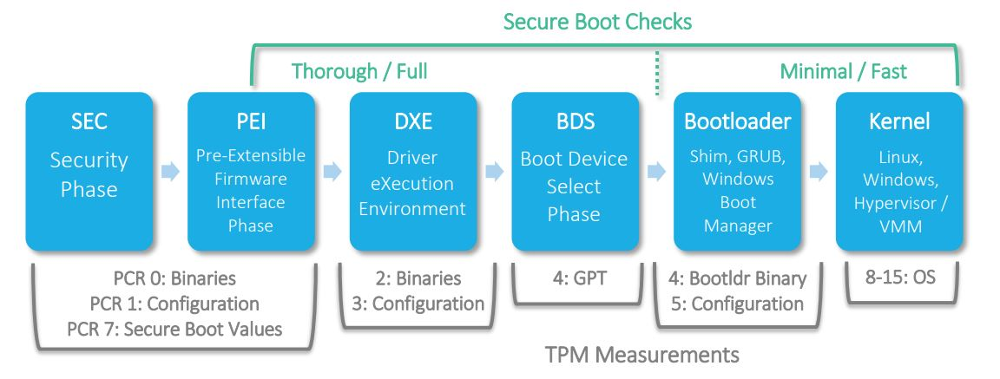

# Firmware Validation for a PC

For a PC, the RIM is created as a Software Identification (SWID) tag that adheres to the
[PC Client RIM specification :fontawesome-solid-external-link:](https://trustedcomputinggroup.org/resource/tcg-pc-client-reference-integrity-manifest-specification/). 
The RIM-Tool supports the [TCG PC Client RIM](../RIMs/tcg-pc-client-rim.md).

## UEFI Boot

Firmware measurements for a UEFI compatible PC are captured by UEFI during the boot phase of 
a device. During the boot process, firmware records cryptographic hashes to the Trusted Platform 
Module (TPM). These hashes capture firmware modules, firmware configuration, expansion component 
firmware, expansion component firmware configurations, and the bootloader. TPM-aware bootloaders 
can continue logging hashes to describe the kernel, initial file system, and any modules. Kernels, 
applications, and drivers can also log runtime hashes to the TPM.

Hashes are stored in the TPM’s Platform Configuration Registers (PCRs) in accordance with 
Figure 1. Most TPMs have 24 PCRs per supported hash algorithm. TPM 2.0 supports SHA-1 and SHA-256 
at the minimum (48 PCRs minimum). PCR values are computed via a series of one-way hashes where 
each measurement hash is appended to the current PCR value, and then the combination is hashed 
and becomes the new PCR value (referred to as “extending the PCR”).


**Figure 1.** The interaction of Secure Boot and TPM with UEFI boot phases
<!-- Hide for now
-->

UEFI also records measurement hashes, along with information about these hashes, in the TPM Event 
Log. The TPM Event Log is an audit log that can be used for verification later, after the system boots.  

Linux has support for reading the TPM Event Log and writing it to the security fs partition for TPM. 
You will need a Linux kernel of 4.18 or higher to see the log at 
`/sys/kernel/security/tpm0/binary_bios_measurements`.

Windows 10 will possibly store (depending upon specific version and group policy) the binary form 
of the TPM Event Log with a numeric name and a .log extension at `C:\Windows\Logs\MeasuredBoot\`.

## PC RIM Bundles
A Verifier will take these UEFI measurements and compare them to a set of expected values in the RIM. 
For the PC Client, there are two different types of RIM files: the Base RIM and the Support RIMs. This 
is designated by the TCG as the “RIM Bundle”. 

### The Base RIM

The PC Client RIM defines the Base Rim as an 
[ISO 197770-2 Software Identity :fontawesome-solid-external-link:](https://www.iso.org/standard/65666.html) 
(SWID) standard compatible file. The Base RIM provides a verifiable identity of the RIM creator and also 
integrity information of Support RIMs. The Base RIM contains:

1. Cryptographically verifiable identification of the creator of the RIM and Support RIMs
2. A unique identifier (tagId) for a set of RIM Bundles
3. A reference to the binding specification that defines the Support RIMs
4. Cryptographic hashes (digests) of all payload references including Support RIMs
5. A digital signature of the RIM signed by the RIM’s creator

The OEM creates the RIM at the end of the production process. The OEM then stores the Base RIM 
onto the device or optionally provides a Uniform Resource Identifier (URI) to access the Base RIM. 

### The Support RIM

A Support RIM contains assertions about the state or configuration of the platform to which 
the RIM applies. There are two types of support RIMs, but the only one that HIRS currently 
uses is the TCG Event Log Assertion Support RIM.

### TCG Event Log Assertion Support RIM 

The TCG Event Log Assertion Support RIM is a required Support RIM file for PC Client Base Rim. It 
is a binary file that contains a list of all the hashes that get extended into the PCRs during 
the boot cycle, as well as details about each hash and each hash's corresponding event. Some 
examples of events are POST_CODE, VARIABLE_DRIVER_CONFIG, EV_IPL, etc. 

!!! note

    While TCG Event Log Assertion Support RIM is similar to the TPM Event Log, the big difference
    is that the TCG Event Log Assertion Support RIM is the expected data from the OEM, while 
    the TPM Event Log is the measured data from a client PC.

When an OEM reaches the end of the production process for a PC, it captures a hash of the TCG 
Event Log Assertion Support RIM and inserts that hash into the Base RIM before the Base RIM is 
signed. Later, a Verifier can use that hash to verify that the TCG Event Log Assertion Support 
RIM has not been altered at any point. (The integrity of the Base RIM itself is verified via the 
Base RIM certificate chain.)

The HIRS ACA uses the TCG Event Log Assertion Support RIM during its validation process if the 
Firmware Validation Policy option is selected. During the HIRS validation process, the TCG Event 
Log Assertion Support RIM is used during the Reference values check: 

1. **Real-time values check**: When the computer boots, UEFI creates the TPM Event Log (the UEFI “audit” log)
which captures the firmware events and their corresponding digests. The Provisioner collects this Event
Log and sends it to the ACA. The ACA uses the digest values within the Event Log to calculate a composite 
hash, which the ACA compares against the composite hash value in the TPM Quote. Should TPM Quote 
verification pass, this proves that the ACA has received the correct TPM Event Log and nothing 
has been altered in the TPM Event Log since it was created during boot. (The Quote has already 
been validated based on the signature and nonce; refer to the HIRS User Guide for more information 
on this.) Should TPM Quote verification fail, the TPM Event Log file is needed to provide details 
on the individual hashes within each PCR. Basically, this first check verifies that our measured 
data is valid.

2. **Reference values check**: Now the measured data needs to be compared to the expected data. Each 
event in the TPM Event Log (supplied by the client, represents the measured data) is compared 
against the events listed in the TCG Event Log Assertion Support RIM (supplied by the OEM, 
represents the expected data) to ensure they are the same. In the case of events failing comparison, 
the Verifier can provide details on which event(s) failed. 

## PC RIM Lifecycle

The SWID specification defines four types of SWID tags: corpus, primary, patch, and supplemental. All 
four tag types come into play at various points in the software lifecycle, and support software 
management processes depend on the ability to accurately determine where each software product is 
in its lifecycle.

### Corpus Base RIM

Corpus Tags are associated with a software installation package. RIM support for corpus is currently 
undefined and not supported by this tool. 

### Primary Base RIM

Primary Base RIM should include all necessary reference measurements needed to verify the firmware 
(PCR 0 -7). The Primary Base RIM is expected to be part of an initial RIM Bundle. 

### Patch Base RIM

Patch Base RIM is intended to accompany firmware updates and include any reference measurements 
necessary to cover the changes provided by the firmware update. 

### Supplemental Base RIM

Supplemental Base RIM: Supplemental RIMs are intended to support RIMs created by organizations 
other than the OEM (e.g. System Integrators or Value-Added Resellers (VARs)). The signature on the 
Base RIM is expected to be signed by the organization that created the Supplemental Base RIM. The 
Supplemental uses the Href element to point to the Primary or Patch RIM for which the Supplemental 
RIM is adding reference measurements. 

## Timestamps

A RIM signer may include a PC Client RIM which optionally supports a simple timestamp or a 
countersignature timestamp. Time stamp services are typically provided by a commercial Time Stamp 
Authority (TSA). Most TSAs support the RFC 3161 Time-Stamp Protocol but the time stamp itself may 
be encoded using a number of methods. 

### RFC3339 Timestamps

The tgc_rim_tool will support the creation of a RFC3339 based timestamp. The format of the time 
is:  

```shell
yyyy-MM-ddThh:mm:ssZ
```

### RFC3852 Timestamps

The RFC3852 includes support for a countersignature. The tgc_rim_tool does not directly support 
the creation of a countersignature but will accept a countersignature file created by a third-party 
application and insert it into a timestamp field within the Base RIM.

## Layered Endorsements (detached signatures)

In some cases, there may be a need for an entity that is not the tag creator to provide a secondary 
signature for the RIM (e.g., a layered endorsement). The PC Client RIM utilizes the W3C-defined 
"Detached Signature" for providing secondary signatures to be applied to an existing signed PC Client 
RIM. The initial Base RIM uses the enveloped signature provided by the tagCreator. Each secondary 
signature will be a sibling element of the BaseRIMs SoftwareIdentity element. The secondary signature 
uses the Base RIM’s tagId as the SignedInfo Reference.

The rim_tool does not directly support the creation of a secondary signature but will accept a secondary 
signature file created by a third-party application and insert it into a timestamp field within the Base RIM.

## Reference Integrity Manifest Specifications for a PC

* The
  [TCG Reference Integrity Information Model :fontawesome-solid-external-link:](https://trustedcomputinggroup.org/resource/tcg-reference-integrity-manifest-rim-information-model/)
  (RIM IM) defines structures that a Verifier uses to validate expected values (Assertions) against
  actual values (Evidence).
* The
  [PC Client RIM specification :fontawesome-solid-external-link:](https://trustedcomputinggroup.org/resource/tcg-pc-client-reference-integrity-manifest-specification/)
  is considered a RIM IM "binding specification" specifically for PC Clients and Servers.
* The
  [TCG PC Client Platform Firmware Profile :fontawesome-solid-external-link:](https://trustedcomputinggroup.org/resource/pc-client-specific-platform-firmware-profile-specification/),
  which is referred to as the "PFP", defines the TPM Event Log. 
